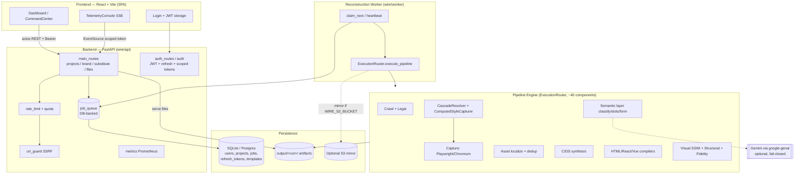
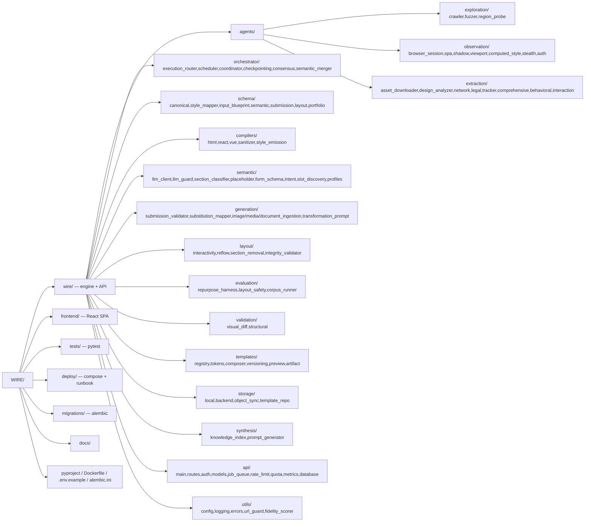
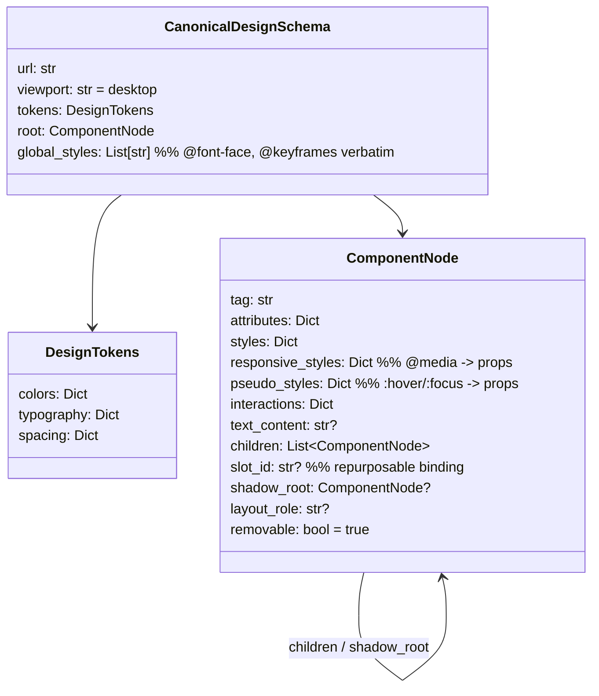
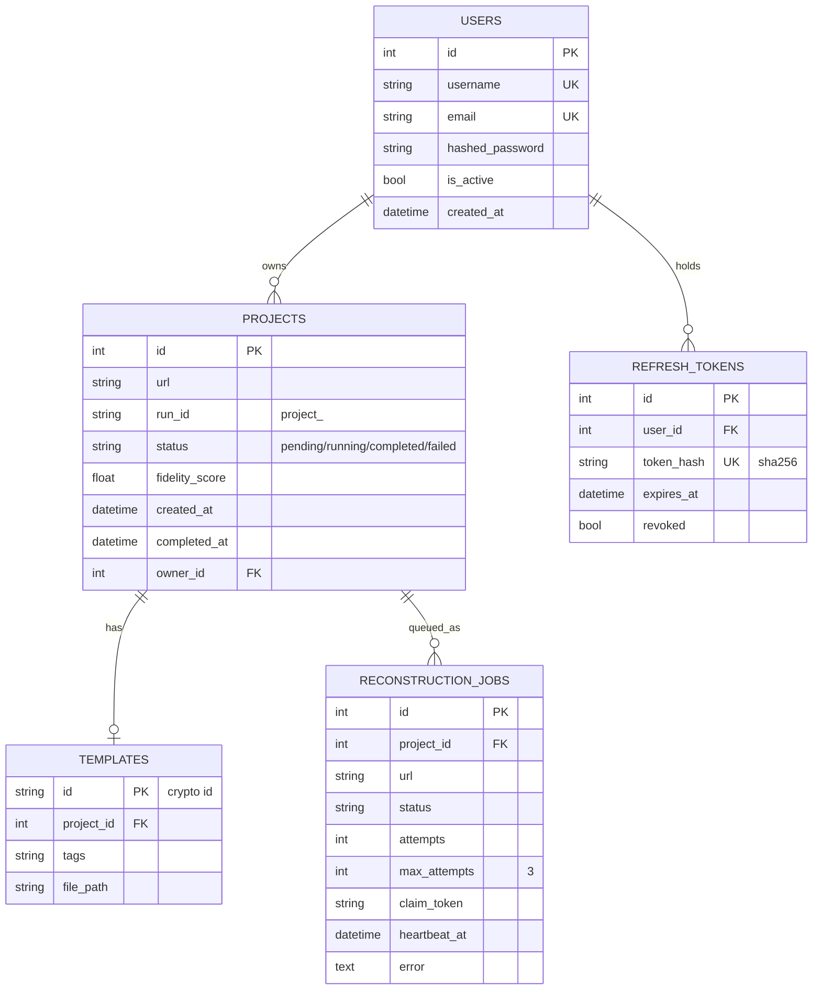
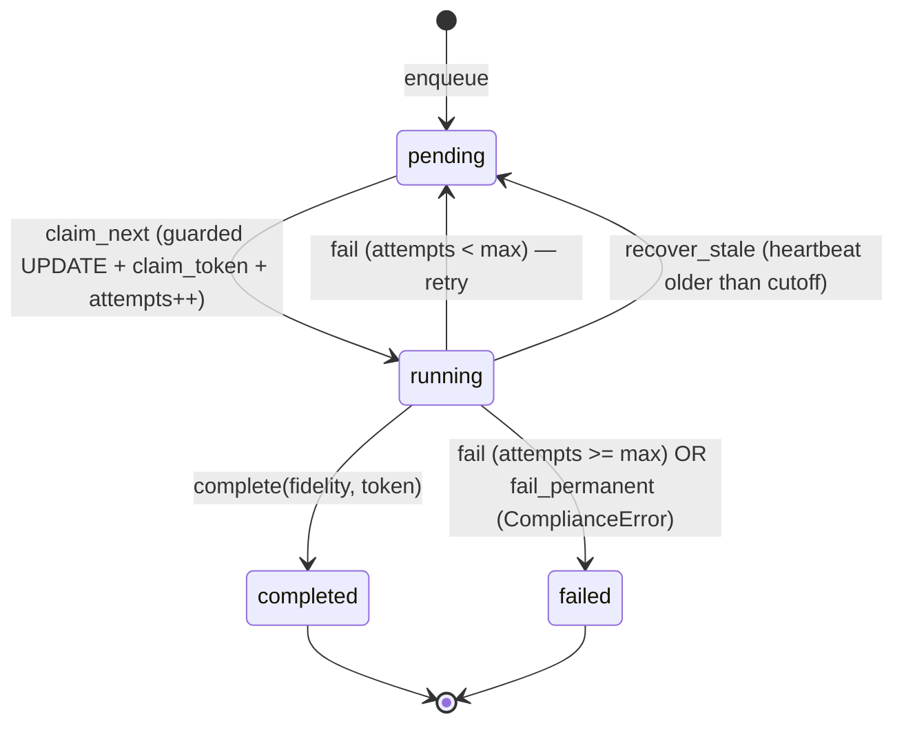
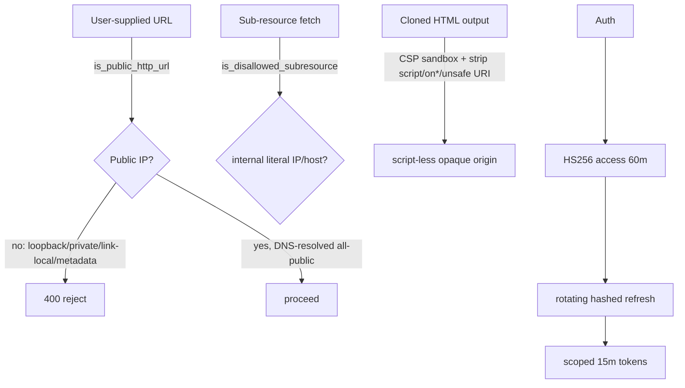
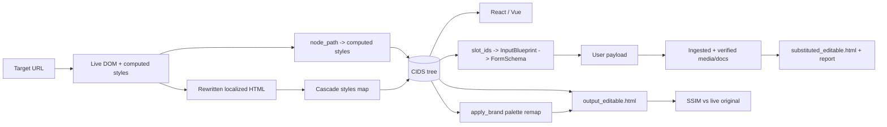
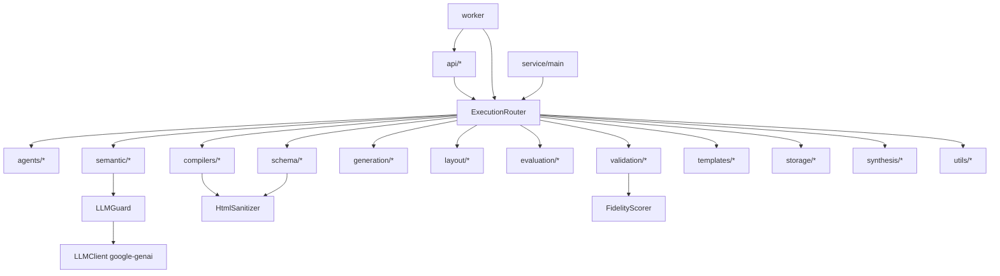

# WIRE — Complete Reverse-Engineering & Technical Specification

> **Scope:** A ground-up technical reconstruction of the WIRE platform derived
> entirely from its source tree (`wire/`, `frontend/`, `tests/`, `deploy/`,
> `migrations/`, build/config manifests). This document is intended to be
> sufficient for an experienced engineer to understand, maintain, extend, or
> rebuild the platform from the documentation alone.
>
> **Confidence legend:** **[H]** high (read directly from source), **[M]**
> medium (inferred from strong signals), **[L]** low / unverified.

---

## 1. Executive Summary

**WIRE (Semantic Web Reconstructor)** ingests a single URL and, from one crawl,
produces two deliverables:

1. **A pixel-faithful clone** — the original page's HTML with every asset
   (images, CSS with nested `@import`/`url()` chains, fonts, icons, media, PWA
   manifests) downloaded and localized, deduplicated by content hash, and
   charset-normalized to UTF-8. This is the high-fidelity diagnostic output
   (`index.html`).
2. **A semantic, editable version** — the page reduced to a **Canonical
   Intermediate Design Schema (CIDS)**, a Pydantic tree of
   tag/attrs/styles/children. The CIDS is classified, has replaceable content
   discovered and bound to form fields, and is recompiled to standalone HTML,
   React, and Vue. **This is the actual product: repurpose someone's layout with
   your own content without breaking it** — and every claim is *measured*
   (visual SSIM at desktop + mobile breakpoints, structural similarity, layout
   safety, a composite repurpose score with honesty guards).

The engine is wrapped in a **FastAPI backend** (JWT auth, projects, a durable
DB-backed job queue, quotas, rate limiting, SSRF guards, Prometheus metrics)
and a **React + Vite dashboard** (reconstruction launch, visual captures, live
preview, brand transfer, multi-modal content substitution, compiled-code
viewer). **[H]**

**Problem solved:** cloning a web layout for reuse normally means either a
brittle screenshot or a hand rebuild. WIRE captures the *design intent* (a
semantic tree with engine-resolved styles) so the layout can be re-skinned and
re-contented programmatically, and it proves fidelity numerically instead of
asserting it. **[H]**

**Target users:** designers/developers repurposing existing layouts, agencies
producing templated sites, and anyone needing a faithful, editable capture of a
page they have the right to reproduce. **[M]**

**Core objectives (verified in code):** fidelity-first defaults, full offline
operation without an LLM, honest measurement (scores capped by what was
actually measured), and safety (robots.txt respect, SSRF guards, sanitized
output). **[H]**

---

## 2. High-Level Architecture



**Style:** modular monolith. One Python package (`wire`) with clearly layered
sub-packages; the API and worker share the same image and an `output/` volume.
Communication is REST + SSE (browser↔API), SQL rows + a claim-token protocol
(API↔worker), and local-disk artifacts (worker↔API file serving). **[H]**

---

## 3. Complete Technology Stack

### 3.1 Backend (Python ≥ 3.11)

| Technology | Version (pin) | Category | Purpose / Where used | Alternatives |
|---|---|---|---|---|
| **Python** | ≥3.11 | Language | Entire backend/engine | — |
| **FastAPI** | ≥0.110 | Web framework | `wire/api/*` REST + SSE | Flask, Starlette, Litestar |
| **Uvicorn** | ≥0.28 | ASGI server | Serves the API (`wire.api.main:app`) | Hypercorn, Daphne |
| **Playwright** | ≥1.42 | Browser automation | `BrowserSession`, all live capture, screenshots | Selenium, Puppeteer |
| **BeautifulSoup4** | ≥4.12 | HTML parsing | CIDS parse, asset rewriting, structural diff | lxml direct, html5lib |
| **lxml** | ≥4.9 | Parser backend | `BeautifulSoup(..., "lxml")` fast tree | html.parser |
| **tinycss2** | ≥1.2 | CSS parsing | `CascadeResolver`, `DesignAnalyzer` declaration iteration | cssutils, cssselect |
| **Pydantic** | ≥2.7 | Data modeling | CIDS, all schemas, request/response models | dataclasses, attrs |
| **SQLAlchemy** | ≥2.0 (async) | ORM | `wire/api/models.py`, async engine | Tortoise, SQLModel |
| **Alembic** | ≥1.13 | Migrations | `migrations/` (4 revisions) | Django migrations |
| **aiosqlite** | ≥0.20 | DB driver | Default SQLite async | — |
| **asyncpg** | ≥0.29 (extra `postgres`) | DB driver | Production Postgres | psycopg |
| **python-jose[cryptography]** | ≥3.3 | JWT | Access/refresh/scoped token encode/decode | PyJWT |
| **passlib[bcrypt]** / **bcrypt** | ≥1.7 | Password hashing | `auth.get_password_hash`/`verify_password` | argon2 |
| **python-multipart** | ≥0.0.9 | Form parsing | OAuth2 password form, uploads | — |
| **sse-starlette** | ≥2.0 | Server-Sent Events | `/api/projects/telemetry` stream | websockets |
| **email-validator** | ≥2.1 | Validation | `EmailStr` on registration | — |
| **Pillow** | ≥10.0 | Imaging | SSIM, image ingestion, perceptual hash | OpenCV |
| **numpy** | ≥1.26 | Numerics | SSIM math, volatility masks | — |
| **httpx** | ≥0.27 | HTTP client | `AssetDownloader` async fetch w/ retries | aiohttp, requests |
| **structlog** | ≥24.1 | Logging | Structured logs everywhere + SSE broadcast | stdlib logging |
| **redis** | ≥5.0 | Cache/limiter | Shared rate limiting across replicas | Memcached |
| **google-genai** | ≥1.0 | LLM SDK | `LLMClient` (Gemini), semantic refinement | google-generativeai (deprecated) |
| **pypdf** | ≥4.0 (extra `documents`) | PDF text | `DocumentIngestionPipeline` | pdfplumber |
| **sentry-sdk** | ≥2.0 (extra `observability`) | Error reporting | `_init_sentry` if `SENTRY_DSN` | — |
| **boto3** | ≥1.34 (extra `objectstore`) | S3 client | `ObjectStorageSync` run mirroring | minio |
| **hatchling** | — | Build backend | `pyproject.toml` build-system | setuptools, flit |

**Dev/quality tooling:** pytest, pytest-asyncio (`asyncio_mode=auto`),
pytest-cov (`--cov-fail-under=90`), Ruff (E,F,I; E501 deferred to Black), Black
(line-length 88), Mypy (`strict=true`), pre-commit. **[H]**

### 3.2 Frontend (Node 20 / TypeScript)

| Technology | Version | Category | Purpose |
|---|---|---|---|
| **React** | ^19.2 | UI library | Dashboard SPA |
| **react-dom** | ^19.2 | Renderer | DOM mount |
| **react-router-dom** | ^7.14 | Routing | `/login`, `/dashboard`, protected routes |
| **axios** | ^1.15 | HTTP client | `src/api.ts` w/ JWT interceptor + silent refresh |
| **lucide-react** | ^1.8 | Icons | Sidebar/panels |
| **Vite** | ^8.0 | Bundler/dev server | `npm run dev`/`build` |
| **@vitejs/plugin-react** | ^6.0 | Build plugin | JSX transform |
| **TypeScript** | ~6.0 | Language | Strict typing |
| **Vitest** | ^4.1 | Test runner | Unit/component tests (jsdom) |
| **@testing-library/react** | ^16.3 | Test utils | Component tests |
| **@playwright/test** | ^1.59 | E2E | `tests/e2e/workflow.spec.ts` |
| **ESLint** | ^9.39 + typescript-eslint | Lint | `eslint.config.js` flat config |

### 3.3 Infrastructure / DevOps

| Technology | Where | Purpose |
|---|---|---|
| **Docker** | `Dockerfile` (python:3.11-slim-bookworm) | API + worker image w/ Chromium, non-root uid 10001, HEALTHCHECK on `/api/status` |
| **Docker Compose** | `deploy/docker-compose.yml` | Postgres 16 + Redis 7 + migrate + api + scalable worker, shared `wire-output` volume |
| **GitHub Actions** | `.github/workflows/ci.yml` | 3 jobs: format-and-lint (black/ruff/mypy) → backend-tests (pytest+cov, Playwright) + frontend-tests (vitest); Codecov upload |
| **Alembic** | `migrations/` | Schema management (sync migrations over async URL translated in `env.py`) |

---

## 4. Project Structure



### 4.1 Directory responsibilities

| Path | Responsibility |
|---|---|
| `wire/main.py` | CLI + minimal FastAPI (`/api/reconstruct`); `wire <url>` entrypoint (`[project.scripts] wire`). |
| `wire/service.py` | `WireService` — thin wrapper constructing `ExecutionRouter` and running the pipeline. |
| `wire/worker.py` | Durable-queue worker: `claim_next` → heartbeat loop → run pipeline → `complete/fail`, stale recovery. |
| `wire/orchestrator/execution_router.py` | **THE pipeline** (~1368 lines): orchestrates ~40 components; also hosts post-run APIs (`remove_sections`, `generate_transformation_prompt`, `evaluate_repurpose`, `apply_brand`). |
| `wire/agents/exploration/` | `Crawler` (same-domain BFS, robots-aware), `InteractionFuzzer` (discovers hoverable/clickable), `RegionProbe` (multi-region re-render — stubbed). |
| `wire/agents/observation/` | `BrowserSession` (Playwright lifecycle, lazy-content trigger, DOM-stability wait), `ComputedStyleCapturer` (getComputedStyle → CIDS, responsive + dark deltas), `ShadowPiercer`, `SPADetector`, `ViewportRenderer`, `StealthManager` (thin), `AuthHandler` (thin). |
| `wire/agents/extraction/` | `AssetDownloader` (localize+dedup+charset), `DesignAnalyzer` (tokens from CSS), `NetworkMonitor` (XHR/API discovery), `LegalDetector` (robots.txt), `TrackerStripper` (opt-in), `ComprehensiveExtractor` (in-browser design knowledge), `BehavioralExtractor` (runtime interaction deltas), `InteractionRecorder` (hover states). |
| `wire/schema/` | `canonical.py` = CIDS + `HTMLToCidsParser`; `style_mapper.py` = `CascadeResolver`; plus `input_blueprint`, `semantic_schema`, `submission_schema`, `layout_schema`, `portfolio_schema`. |
| `wire/compilers/` | `HTMLCompiler` (flatten to inline + `<style>` for media/pseudo/global), `ReactAdapter`, `VueAdapter`, `HtmlSanitizer`, `style_emission` (dedup classes, CSS render). |
| `wire/semantic/` | LLM integration + heuristics: `LLMClient`, `LLMGuard`, `SectionClassifier`, `PlaceholderDetector`, `FormSchemaCompiler`, `IntentReconciler`, `HeuristicSlotDiscoverer`, `profiles/portfolio_profile`. |
| `wire/generation/` | Content-substitution side: `SubmissionValidator`, `SubstitutionMapper`, `Image/Media/DocumentIngestionPipeline`, `TransformationPromptGenerator`. |
| `wire/layout/` | Layout mutation: `InteractivityTransformer` (JS→CSS restore), `SectionRemovalPlanner`, `LayoutReflowEngine`, `StructuralIntegrityValidator`. |
| `wire/evaluation/` | Measured product success: `RepurposeEvaluator`, `ContentFitValidator` (layout safety), `CorpusRunner` (fixture-corpus baseline). |
| `wire/validation/` | `VisualDiff` (SSIM, pixel, perceptual hash, volatility mask), `StructuralValidator` (DOM tree alignment). |
| `wire/templates/` | Phase-6 template ecosystem: `TemplateRegistry`, `DesignTokenSystem` (palette remap), `TemplateComposer`, `TemplateVersioning`, `TemplatePreview`, `WireArtifact` (`.wire` package + verify). |
| `wire/storage/` | `LocalStorage` (run dirs), `ObjectStorageSync` (S3 mirror), `TemplateRepository`, `StorageBackend` ABC. |
| `wire/synthesis/` | `KnowledgeIndex` (design search by color/url), `PromptGenerator` (AI design prompts). |
| `wire/api/` | FastAPI app, routes, auth, ORM models, durable job queue, rate limiting, quota, metrics, DB session. |
| `wire/utils/` | `config`, `logging` (structlog + SSE broadcaster), `errors` (`ComplianceError`), `url_guard` (SSRF), `fidelity_scorer`. |
| `frontend/` | Vite React SPA: `App.tsx` (router), `components/Login.tsx`, `components/Dashboard.tsx` (CommandCenter + TelemetryConsole), `api.ts` (axios + refresh). |
| `tests/` | `unit/`, `integration/`, `e2e/`, phase suites, `fixtures/corpus/` (6 HTML fixtures). |

---

## 5. The Reconstruction Pipeline (end-to-end)

`ExecutionRouter.execute_pipeline(url, run_id)` is the spine. Per-page work is
in `_process_page`.

```mermaid
sequenceDiagram
    participant W as Worker
    participant ER as ExecutionRouter
    participant L as LegalDetector
    participant C as Crawler
    participant B as BrowserSession (Chromium)
    participant AD as AssetDownloader
    participant OBS as Observers (SPA/Shadow/Network/ComputedStyle)
    participant CR as CascadeResolver
    participant P as HTMLToCidsParser
    participant CO as Compilers (HTML/React/Vue)
    participant SEM as Semantic layer
    participant V as Validators (Visual/Structural)
    participant FS as FidelityScorer

    W->>ER: execute_pipeline(url, project_id)
    ER->>ER: storage.initialize_for_url + CheckpointManager
    ER->>L: analyze(url) -> compliance_report.json
    ER->>ER: _check_compliance (raise ComplianceError if robots restricted)
    ER->>C: crawl(url, single_page)
    ER->>B: start() (apply auth credentials if set)
    loop each page (skip checkpointed)
        ER->>B: capture_page (lazy-scroll + DOM stability)
        opt tracker stripping (opt-in)
            ER->>ER: TrackerStripper.strip
        end
        ER->>AD: download_assets -> rewritten HTML + localized assets
        ER->>ER: DesignAnalyzer.extract_design_architecture
        ER->>OBS: SPA detect, shadow pierce, network monitor, computed styles (desktop+responsive+dark)
        ER->>OBS: ComprehensiveExtractor, ViewportRenderer, Fuzzer, InteractionRecorder, RegionProbe
        ER->>ER: dynamic-region volatility mask (3x re-render)
        ER->>CR: resolve(html, css) -> cascade styles map
        ER->>P: parse -> CIDS (prefers computed styles over cascade)
        ER->>ER: HeuristicSlotDiscoverer.discover -> InputBlueprint + slot_ids
        ER->>CO: compile_document -> output_editable.html
        ER->>ER: InteractivityTransformer -> output_interactive.html
        ER->>CO: ReactAdapter/VueAdapter -> jsx/vue
        ER->>SEM: classify + placeholder + form schema (+ intent, +profile)
        ER->>V: StructuralValidator.compare(original, editable)
        ER->>V: VisualDiff SSIM desktop + tablet/mobile breakpoints (masked)
        V->>FS: record structural / visual / responsive similarity
    end
    ER->>ER: SemanticMerger.merge, TemplateRepository.store
    ER->>ER: Phase 6 template ecosystem + .wire artifact + verify
    ER->>ER: checkpoint.clear; ObjectStorageSync (if enabled)
    ER->>FS: compute_score() -> float
    ER-->>W: fidelity score
```

**Ordering rationale (from source):** legal/robots gate is first so a disallowed
target never gets fetched; assets are localized *before* CIDS build so `url()`
props resolve to local paths; computed styles are captured at the same 1920×1080
viewport used for the visual diff so the CIDS reflects what was scored; the
**editable** output — not the clone — is what the fidelity score is capped by,
because the clone is near-identical to the DOM by construction and would flatter
the number. **[H]**

### 5.1 Key pipeline artifacts per run (`output/<run>/`)

`index.html` (clone), `output_editable.html` (product), `output_interactive.html`
(CSS-restored interactions), `output_react.jsx`, `output_vue.vue`,
`schema_cids.json`, `schema_blueprint.json`, `website_form_schema.json`,
`section_classifications.json`, `design_architecture.json`,
`compliance_report.json`, `spa_detection.json`, `shadow_dom.json`,
`computed_styles.json`, `network_report.json`, `api_discovery_blueprint.json`,
`extraction_report.json`, `viewports.json`, `interactions_fuzz.json`,
`interaction_catalogue.json`, `region_variants.json`, `dynamic_regions.json`,
`cascade_styles_map.json`, `visual_fidelity_report.json`,
`visual_fidelity_breakpoints.json`, `structural_validation.json`,
`interactivity_report.json`, `ai_design_prompts.json`, `<template_id>.wire`,
`artifact_verification.json`, and (post-run) `substituted_editable.html`,
`repurpose_report.json`, `transformation_prompt.json`, `object_sync_report.json`.
**[H]**

---

## 6. The CIDS (Canonical Intermediate Design Schema)

The heart of the semantic path. Defined in `wire/schema/canonical.py`. **[H]**



**`HTMLToCidsParser`** walks the BeautifulSoup tree and, per node:
excludes non-visual/unsafe tags (`script`, `style`, `iframe`, `object`, …);
strips `on*` handlers and unsafe URIs via `HtmlSanitizer._is_safe_uri`;
computes a browser-aligned `node_path` (`#id` short-circuit, else
`tag:nth-of-type(n)` chain) so computed styles / shadow roots key-align with the
in-browser `getPath`; **prefers engine-computed styles** over the heuristic
cascade (they already resolve specificity/`!important`/inheritance/`var()`);
resolves CSS custom properties (`var()`), applies an inheritance model for a
fixed `INHERITABLE_PROPS` set; and threads responsive/pseudo/shadow maps. A
proportional-consistency check (`cids_count ≥ 10% of DOM nodes`) guards against
extraction collapse. **[H]**

---

## 7. Subsystem Deep-Dives

### 7.1 Style capture — browser-first with heuristic fallback

Two paths feed node styles: **`CascadeResolver`** (`style_mapper.py`) parses CSS
with tinycss2, computes specificity, and resolves the cascade heuristically,
gating properties through a **denylist** (`denied_props` + `_accept_prop`) —
everything visual is kept unless explicitly non-visual/behavioral. **[H]**
**`ComputedStyleCapturer`** reads `getComputedStyle` per element in-browser into
a `node_path`-keyed map; the parser prefers these authoritative values.
`url()`-bearing props are *excluded* from computed capture (they resolve to
absolute URLs) and come from the localized cascade instead. Responsive deltas
(`capture_responsive`) and dark-mode deltas (`capture_color_scheme`, emulating
`prefers-color-scheme: dark`) merge into one `@media` map. **[H]**

### 7.2 Asset localization (`AssetDownloader`)

Async `httpx` fetch with retry/backoff (honoring `Retry-After`); per-run URL
cache (fetch each URL once) + **sha256 content-hash dedup** (identical bytes →
one local file; CSS/manifests exempt because their rewritten refs are
source-relative); declared charsets normalized to UTF-8; recursive
`@import`/`url()` CSS chains localized (`_process_css_imports`,
`_process_css_urls`); PWA manifest icons/screenshots and
`preload`/`prefetch`/`modulepreload` hrefs localized; DOCTYPE preserved (never
invented). Sub-resource fetches are SSRF-screened via
`url_guard.is_disallowed_subresource`. **[H]**

### 7.3 Compilers

| Compiler | Output | Notes |
|---|---|---|
| `HTMLCompiler.compile_document` | Standalone HTML5 | Flattens styles to inline `style=""`; emits one `<style>` block for what inline can't express: `@media`, `:hover`/`:focus`, `@font-face`/`@keyframes` (from `global_styles`), and **deduplicated style classes** (`wire-r{n}`); integrates Shadow DOM as Declarative Shadow DOM `<template shadowrootmode>`; re-sanitizes tags/attrs (defense-in-depth). By design a *lower fidelity ceiling* than the clone. |
| `ReactAdapter.compile` | `.jsx` | CIDS → JSX; `class→className`, CSS props → camelCase, inline `style={{}}`. |
| `VueAdapter.compile` | `.vue` | SFC template/script/style. |
| `style_emission` | helper | `count_inline_styles` → `mint_dedup_classes`, `render_css`, `_localize_global_url_refs`. |

### 7.4 Semantic interpretation layer (Phase 7)

`_run_semantic_interpretation` runs: **1)** `SectionClassifier.classify_tree`
(heuristic + optional LLM) → roles from a general taxonomy (`SectionRole`:
hero/nav/about/services/portfolio/testimonials/team/pricing/contact/footer/…);
**2)** `FormSchemaCompiler.compile` → `WebsiteFormSchema` of `FormField`s
(field_type from slot constraint, content_state from `PlaceholderDetector`,
label generated), detecting repeatable groups; **3)** optional
`IntentReconciler.reconcile` if an `intent_prompt` is set; **4)** optional
`PortfolioProfile.adapt` if `domain_profile == "portfolio"`. **[H]**

**Offline-first repurposing:** `HeuristicSlotDiscoverer` binds `slot_id`s onto
replaceable leaf text and images (≤ `MAX_SLOTS=300`) and builds a real
`InputBlueprint` *before* the LLM runs — so the form schema exposes editable
fields with zero LLM calls. The LLM only *refines* these. **[H]**

### 7.5 LLM integration (fail-closed)

`LLMClient` wraps `google-genai` (`from google import genai`), model
`gemini-2.0-flash` (override `WIRE_LLM_MODEL`), key from
`GEMINI_API_KEY`/`GOOGLE_API_KEY`. `generate_json` uses Gemini JSON response
mode and returns `None` on any failure (no key, empty, non-dict, parse error).
Every call routes through **`LLMGuard`**, which prepares/validates I/O, enforces
a per-run **call budget** (`_check_budget`/`reset_call_count`), and validates
classification/placeholder/intent outputs before they touch the schema. Net
effect: **the entire pipeline runs correctly offline**; LLM tests skip without a
key. **[H]**

### 7.6 Validation & fidelity scoring

`VisualDiff.compute_ssim` implements SSIM (Wang et al.): images downscaled to a
bounded 512px long side, grayscale, 7px window; an `ignore_mask` (from
`volatility_mask`, computed by re-rendering the page 3× and diffing) excludes
dynamic regions (ads/carousels). Also provides pixel fidelity, perceptual hash +
Hamming distance, and normalized screenshot comparison. `StructuralValidator`
builds signature trees and aligns children (DOM-structure %).
**`FidelityScorer`** starts at 100, subtracts 2.5 per non-critical error, returns
0 on any critical error, and **caps the score by the minimum of measured visual
SSIM, structural %, and mean responsive-breakpoint SSIM** — an error-free but
divergent page is never "100%". Visual/structural below 40% escalate to critical.
**[H]**

### 7.7 Content substitution & repurpose measurement

`generate_transformation_prompt` (Phase 9): strict `SubmissionValidator.validate`
(hard-block) → multi-modal ingestion (`Image`/`Media`/`Document`IngestionPipeline
decode+verify magic bytes, store, replace base64 with a path; images derive
alt-text/dominant-color/dimensions; documents extract text+structure) →
`SubstitutionMapper.map` → `TransformationPromptGenerator.generate` (LLM
summarizing only). `evaluate_repurpose` (Phase 0) actually applies a payload,
recompiles `substituted_editable.html`, and writes an honest
`repurpose_report.json` scoring slot-fill + content-presence + structural
integrity + **layout safety** (`ContentFitValidator`: overflow, empty required
slot, aspect-ratio change). Honesty guard: nothing repurposed → success 0. **[H]**

### 7.8 Layout mutation & interactivity

`remove_sections` (Phase 8): `SectionRemovalPlanner.plan` →
`LayoutReflowEngine.execute` → `StructuralIntegrityValidator.validate` (orphaned
nav, grid capacity, section ordering, spacing scales, dangling slots) — invalid
plans abort without recompiling. `InteractivityTransformer` restores JS-driven
UI declaratively into a **separate** `output_interactive.html` (never the scored
output): dropdowns → `:hover`/`:focus-within`; ARIA disclosures → `<details>`;
ARIA tabs → `:target` + `:has()`; carousels → CSS scroll-snap (autoplay out of
scope). **[H]**

---

## 8. API Reference

Base app: `wire/api/main.py` (title *WIRE Platform API*), CORS from
`WIRE_CORS_ORIGINS`, security-headers middleware (nosniff, no-referrer, frame
DENY except served files, opt-in HSTS) + request-latency histogram. **[H]**

| Method | Path | Auth | Purpose |
|---|---|---|---|
| GET | `/api/status` | none | Health `{status, version}` |
| GET | `/api/metrics` | none | Prometheus counters/histograms |
| POST | `/api/auth/register` | IP rate-limited | Create user → access+refresh token |
| POST | `/api/auth/login` | IP rate-limited | OAuth2 password form → tokens |
| POST | `/api/auth/refresh` | refresh token | Rotate (single-use) → new pair |
| POST | `/api/auth/logout` | refresh token | Revoke refresh token |
| GET | `/api/auth/stream-token` | session | Mint `telemetry`-scoped short-lived token |
| POST | `/api/projects` | session | Enqueue reconstruction (SSRF + rate + daily quota checks) |
| GET | `/api/projects` | session | List caller's projects |
| POST | `/api/projects/{id}/brand` | session | Apply brand palette, recompile outputs |
| POST | `/api/projects/{id}/substitute` | session | Submit content → validate/ingest/prompt |
| GET | `/api/projects/{id}/file-token` | session | Mint `files`-scoped, project-bound token |
| GET | `/api/projects/{id}/files/{path}` | session or scoped | Serve run artifact (CSP `sandbox` on html/svg/xml; traversal-guarded) |
| GET | `/api/projects/telemetry` | scoped/session | SSE pipeline log stream (bounded queue) |
| POST | `/api/reconstruct` | none | *Standalone* minimal app in `wire/main.py` (synchronous, not the platform) |

**Token model:** short-lived HS256 access tokens (default 60 min) + rotating,
revocable, hashed refresh tokens (14 days, single-use) + purpose-scoped
short-lived tokens (15 min) for browser contexts that can't send an
`Authorization` header (``/`<iframe>` src, EventSource). Session JWTs are
**rejected from query strings**. **[H]**

---

## 9. Data Model & Persistence



**Migrations (Alembic, 4 revisions):** initial schema (users/projects/templates)
→ add `reconstruction_jobs` → refresh tokens + job claim columns (`claim_token`,
`heartbeat_at`) → add `projects.run_id`. Async engine (`aiosqlite` default,
`asyncpg` prod); `Base.metadata.create_all` also runs at API startup for dev
convenience. **[H]**

**Two storage tiers:** (1) SQL for platform state; (2) local disk
`output/<run_id>/` for artifacts (`LocalStorage`, `run_id` sanitized), served
directly by the API; optional (3) S3 mirror at run completion. Runs are
namespaced `project_<id>` so two users cloning the same domain never collide.
**[H]**

---

## 10. Durable Job Queue & Worker Protocol



Broker-free concurrency: claiming is an optimistic
`UPDATE … WHERE status='pending'` (safe on SQLite and Postgres). Every claim
mints a **`claim_token`**; all result writes are guarded by it, so a worker whose
job was requeued as stale can't double-write (its late result is *discarded* and
counted). A 60s heartbeat loop keeps a long-but-alive run from being reclaimed;
`recover_stale` (default 1800s) requeues only genuinely dead workers.
`ComplianceError` (robots block) → `fail_permanent`, never retried. Scale by
running N `wire.worker` processes. **[H]**

---

## 11. Security Model



- **SSRF guard** (`url_guard`): only http(s) to hosts resolving *entirely* to
  public IPs; blocks loopback/private/link-local/reserved/multicast + the cloud
  metadata address (`169.254.169.254`); DNS-resolves hostnames so a public-looking
  name mapping internally is still blocked. Applied at the API trust boundary and
  per sub-resource. **[H]**
- **Output sanitization:** parser and compiler both strip `<script>`/`<style>`/
  `<iframe>`/`on*`/`javascript:` URIs; served reconstructions carry CSP `sandbox`
  so cloned JS can never run against the API origin or read an embedding token.
  **[H]**
- **AuthN/Z:** bcrypt passwords (NIST-style length policy, 72-byte cap);
  short-lived access + single-use rotating hashed refresh tokens (revocation
  path); purpose-scoped, project-bound tokens for URL-embeddable contexts;
  session JWTs never accepted from query strings; per-project ownership checks on
  every project route. **[H]**
- **Abuse control:** per-user reconstruction rate limit (10/min), per-IP auth
  limit (20/min), per-user daily quota (50); Redis-backed across replicas
  (fails *open* on Redis outage — abuse control, not an auth boundary). **[H]**
- **Compliance:** `robots.txt` respected by default (`respect_robots`); tracker
  stripping off by default (fidelity-first). **[H]**
- **Secrets:** `JWT_SECRET_KEY` required in prod (ephemeral random + warning if
  unset); no baked secrets in the image. **[H]**

---

## 12. Configuration Reference

| Variable | Default | Purpose |
|---|---|---|
| `JWT_SECRET_KEY` | ephemeral random | JWT signing (required in prod) |
| `DATABASE_URL` | `sqlite+aiosqlite:///./wire_platform.db` | Async SQLAlchemy URL |
| `WIRE_REDIS_URL` | unset (in-proc limiter) | Shared rate limiting |
| `WIRE_CORS_ORIGINS` | `localhost:5173,127.0.0.1:5173` | Allowed browser origins |
| `WIRE_ENABLE_HSTS` | off | Emit HSTS (behind TLS only) |
| `WIRE_ACCESS_TOKEN_MINUTES` / `WIRE_REFRESH_TOKEN_DAYS` | 60 / 14 | Session lifetimes |
| `WIRE_RATE_LIMIT_RECONSTRUCTIONS` / `WIRE_RATE_LIMIT_AUTH` | 10 / 20 | Per-minute budgets |
| `WIRE_DAILY_RECONSTRUCTION_QUOTA` | 50 | Per-user daily cap |
| `GEMINI_API_KEY` / `GOOGLE_API_KEY` | unset | LLM (optional; offline otherwise) |
| `WIRE_LLM_MODEL` | `gemini-2.0-flash` | Model override |
| `SENTRY_DSN` | unset | Error reporting (extra `observability`) |
| `WIRE_S3_BUCKET` / `WIRE_S3_PREFIX` / `WIRE_S3_ENDPOINT_URL` | unset / `runs` / — | Run mirror (extra `objectstore`) |
| `PLAYWRIGHT_BROWSERS_PATH` | `/opt/pw-browsers` | Chromium location |

**Runtime `ExecutionRouter` flags:** `enable_semantic_layer` (True),
`enable_multi_page_crawl` (False), `enable_behavioral_capture`/`behavioral_deep`
(False), `respect_robots` (True), `enable_tracker_stripping` (False),
`auth_credentials` (None), `domain_profile`/`intent_prompt` (None). **[H]**

---

## 13. Pipelines Inventory

| Pipeline | Input → Output | Key stages |
|---|---|---|
| **Reconstruction** | URL → fidelity score + artifacts | legal → crawl → capture → assets → styles → CIDS → compile → semantic → validate |
| **Request (API)** | HTTP → JSON | CORS → security headers + latency → auth → rate/quota/SSRF → route |
| **Job** | enqueue → completed/failed | claim(token) → heartbeat → run → guarded result → stale recovery |
| **Build (backend)** | source → wheel | hatchling; Docker layer-cached deps + Chromium |
| **Build (frontend)** | TS/JSX → static | `tsc -b && vite build` |
| **CI/CD** | push/PR → pass | lint/type → backend pytest+cov(≥90) + frontend vitest |
| **AI inference** | schema input → validated JSON | LLMGuard prepare → Gemini JSON mode → validate/fail-closed |
| **Content substitution** | payload → transformation prompt | validate → ingest(magic-byte verify) → map → prompt |
| **Validation** | original+editable → scores | SSIM (masked) + breakpoints + structural → FidelityScorer caps |
| **Storage** | run dir → served + mirrored | LocalStorage → API FileResponse → optional S3 |
| **Caching/dedup** | assets/styles → deduped | URL cache + sha256 content dedup; inline-style dedup classes |

---

## 14. Feature Inventory

**User-facing:** launch reconstruction from a URL; project list w/ status +
fidelity; visual captures (desktop/tablet/mobile); live editable preview (sandboxed
iframe); **brand transfer** (palette remap + recompile); **content substitution**
(text/image/video/audio/document, multi-modal); compiled-code viewer
(React/Vue/HTML); AI design prompts; live SSE telemetry console; JWT
login/register with silent refresh. **[H]**

**Engine features:** pixel clone; CIDS extraction; computed-style (incl. dark +
responsive) capture; shadow-DOM piercing; SPA detection + DOM-stability wait;
lazy-content trigger; network/API discovery; asset localization+dedup+charset;
declarative interactivity restore; section removal + reflow; repurpose
evaluation; layout-safety checks; `.wire` artifact packaging + verification;
template registry/versioning/preview; knowledge index (design search); AI prompt
generation; multi-region + consensus (stubbed); checkpoint/resume. **[H]**

**Ops/admin/dev:** Prometheus `/api/metrics`; Sentry; S3 durability mirror;
durable retrying queue with heartbeats; `CorpusRunner` measured baseline
(`CORPUS_BASELINE.md`); `scripts/audit_conformity.py`. **[H]**

**Known thin/stubbed (from CLAUDE.md, verified):** `stealth.py`,
`auth_handler.py`, `coordinator.py` (single-node in-memory lock), Phase-5
consensus (re-renders same URL 3×), `region_probe` (no real geo egress).
`scheduler.py` is honest bounded concurrency (`asyncio.Semaphore`). **[H]**

---

## 15. Frontend Architecture

```mermaid
graph TD
    MAIN[main.tsx] --> APP[App.tsx Router]
    APP --> LOGIN[/login Login]
    APP --> PROT[ProtectedRoute wire_token]
    PROT --> DASH[DashboardView MainLayout]
    DASH --> CC[CommandCenter]
    DASH --> TC[TelemetryConsole SSE]
    CC --> API[api.ts axios + interceptors]
    TC --> API
    API -->|Bearer + silent refresh| BACKEND[(FastAPI)]
```

`api.ts` injects the Bearer token, and on a 401 performs a **single, shared,
in-flight refresh** (concurrent 401s await one refresh), retrying the original
request or clearing tokens and redirecting to login. `CommandCenter` drives the
whole product surface (reconstruct, project list, tabbed asset modal: visuals /
live preview + brand controls / content editor / compiled code / AI prompts).
`TelemetryConsole` mints a telemetry-scoped token then opens an `EventSource`.
Media uploads are read as base64 and posted to `/substitute`. State is local
React `useState`/`useEffect` (no Redux). **[H]**

---

## 16. Data Flow



Serialization: CIDS ↔ JSON via Pydantic `model_dump_json`/`model_validate`
(`schema_cids.json` is the durable source for all post-run mutations). Design
tokens, form schema, reports all persist as JSON in the run dir. **[H]**

---

## 17. Dependency / Module Graph (internal)



Notable coupling: `canonical.py` imports the compiler `HtmlSanitizer` *after*
defining its models (deliberate, to dodge a circular import — hence the
`E402` per-file ignore). The API's post-run routes share one lazily-built
`ExecutionRouter` (constructing ~40 components per request would be far too
heavy). **[H]**

---

## 18. Development, Testing & Quality

**Local dev:** `python -m venv .venv && .venv/bin/pip install -e ".[dev]"` →
`playwright install chromium` → run API (`uvicorn wire.api.main:app`), worker
(`python -m wire.worker`), frontend (`npm run dev`). CLI: `python -m wire.main
<url>`. **[H]**

**Testing:** ~90 backend test files (`unit/`, `integration/`, `e2e/`, phase
suites), `asyncio_mode=auto`, custom markers `slow` / `live_llm`; fixture corpus
of 6 HTML pages (carousel, faq_accordion, nav_dropdown, pricing_cards,
static_hero, tabs). Coverage gate **≥90%** (`--cov-fail-under=90`). Frontend:
Vitest (jsdom) + Playwright E2E. `CorpusRunner` produces a measured success
baseline. **[H]**

**Quality gates (CI-enforced):** Black (88), Ruff (E,F,I; E501 → Black), Mypy
`strict`. Google-style docstrings, structlog logging. Pre-existing black/ruff
backlog — format only touched files. **[H]**

---

## 19. Reconstruction Guide (rebuild-from-spec checklist)

1. **Scaffold** a Python ≥3.11 package `wire/` (hatchling) with the sub-packages
   in §4; React+Vite+TS frontend.
2. **CIDS first** (§6): implement `ComponentNode`/`CanonicalDesignSchema` +
   `HTMLToCidsParser` with `node_path` matching an in-browser `getPath`; wire in
   the `HtmlSanitizer` and `var()` resolution.
3. **Capture layer:** Playwright `BrowserSession` (lazy-scroll, DOM-stability),
   `ComputedStyleCapturer` (desktop + responsive + dark), SPA/shadow/network
   observers, `ViewportRenderer`.
4. **Assets:** `AssetDownloader` (httpx retry, URL cache, sha256 dedup, charset
   normalize, recursive CSS localization, manifest/preload) with SSRF sub-resource
   screening.
5. **Styles:** `CascadeResolver` (tinycss2 + specificity + denylist); parser
   prefers computed styles.
6. **Compilers:** HTML (inline + generated `<style>` for media/pseudo/global +
   dedup classes + declarative shadow), React, Vue.
7. **Semantic:** `HeuristicSlotDiscoverer` (offline floor) → `SectionClassifier`
   → `FormSchemaCompiler` → optional `LLMGuard`/`LLMClient` (fail-closed) +
   `IntentReconciler` + domain profiles.
8. **Validation:** `VisualDiff` SSIM (bounded downscale, volatility mask) +
   breakpoints, `StructuralValidator`, `FidelityScorer` (cap-by-measured, honesty).
9. **Substitution/eval:** validator → ingestion (magic-byte verify) → mapper →
   transformation prompt; `RepurposeEvaluator` + `ContentFitValidator`.
10. **Orchestrate:** `ExecutionRouter.execute_pipeline` in the §5 order +
    checkpoint/resume + template ecosystem + `.wire` artifact + optional S3 sync.
11. **Platform:** FastAPI (§8 routes), SQLAlchemy models (§9), Alembic migrations,
    JWT/refresh/scoped auth, rate/quota, SSRF guard, metrics; durable job queue +
    worker (§10 claim-token protocol).
12. **Frontend:** router + protected routes, axios silent refresh, CommandCenter
    tabs, SSE telemetry.
13. **Ops:** Dockerfile (Chromium, non-root), compose (pg+redis+migrate+api+worker),
    CI (lint/type/test ≥90%).

---

## 20. Knowledge Gaps, Assumptions & Unknowns

| Item | Status | Confidence |
|---|---|---|
| Exact SSIM/structural formulas | Read from `visual_diff.py`/`structural.py` signatures + docstrings; full numeric internals summarized, not line-traced | **[H]** |
| Runtime performance numbers (per-page seconds) | Not benchmarked here; behavioral capture "~8–10s" is a code comment | **[M]** |
| `stealth.py`, `auth_handler.py`, `region_probe.py`, `consensus.py` depth | Documented as thin/stubbed in CLAUDE.md and confirmed by small file sizes; not exhaustively read | **[M]** |
| LLM prompt exact text | `LLMGuard` prepares inputs; specific prompt strings not fully reproduced here | **[M]** |
| `IMPLEMENTATION_PLAN.md` vs. shipped code | Plan doc exists (28KB); this spec reflects **code**, which may diverge from the plan | **[M]** |
| Frontend `Login.tsx`, CSS, e2e specifics | Confirmed to exist; not line-read | **[M]** |
| Production scaling limits (worker count, DB) | Compose supports `--scale worker=N`; no load-test data | **[L]** |
| `google-genai` API surface stability | Pinned ≥1.0; Gemini API subject to provider change | **[L]** |

**Assumptions made:** (a) the platform is the intended product path and
`wire/main.py`'s standalone app is a legacy/CLI convenience; (b) "Phase N" labels
in code are historical build order, not runtime gates; (c) CLAUDE.md's "verified,
not aspirational" gap list is accurate — cross-checked against file sizes and
signatures and found consistent. **[H]**

Anything genuinely not determinable from source is marked **"Not identifiable
from the available source"** inline where it arose; none blocked the core spec.

---

*Generated by static reverse-engineering of the WIRE repository. Every
architectural claim is traceable to a file in `wire/`, `frontend/`, `deploy/`,
`migrations/`, or the build manifests.*
